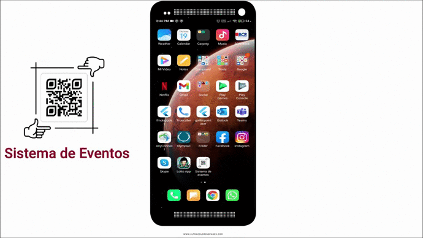
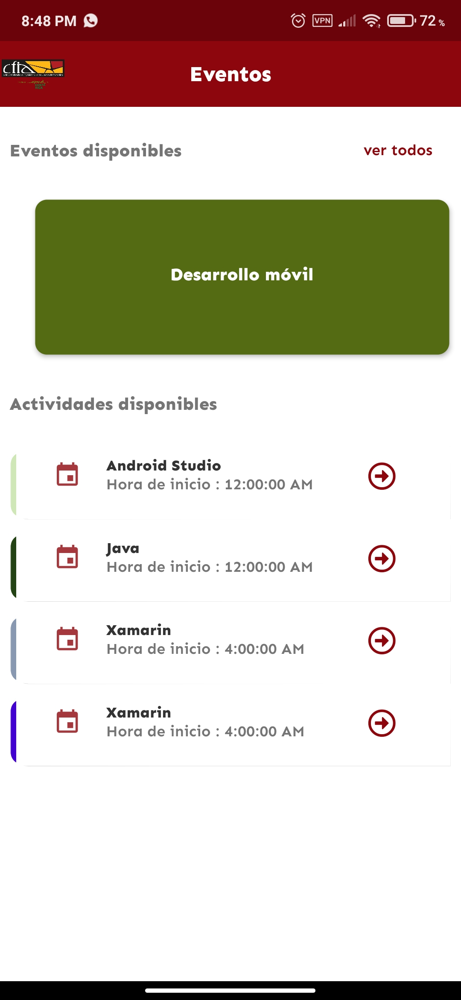
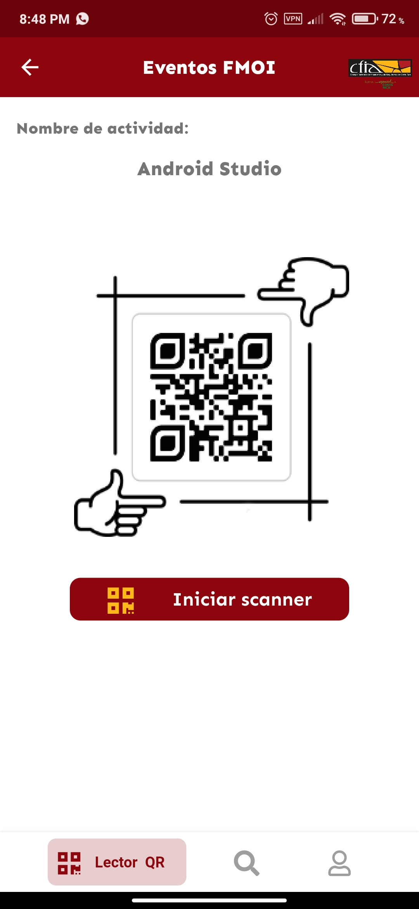
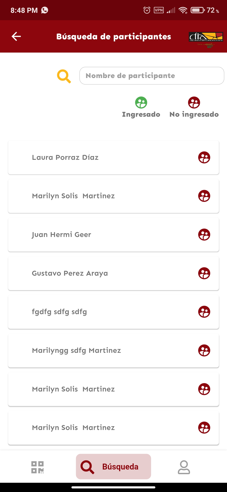

# Sistema-Eventos
Sistema de Asistencia de eventos creada para el Colegio Federado de ingenieros y de Arquitectos de Costa Rica

# Proyecto Universitario, Universidad de Costa Rica.
# Desarrollada por Lorenzo Carazo Zuñiga.

Aplicación encargada de manejar a la asistencia de las pesonas a diferentes eventos y actividades, mediante la implementación de un lector QR.
indica si la persona tiene acceso o no a una actividad de un evento en especifico, si este puede ingresar lo registra.

# Video del funcionamiento de la aplicación.

# Código disponible.

# Fotos del aplicativo.

